# Slab
SLAB connects customers with verified construction equipment and service providers through fast booking, transparent estimates, smart matching, real-time tracking, and reliable site operations across Kerala.

## Screenshots

### Landing / Hero

SLAB's public landing page with the cinematic equipment hero, booking entry point, and trust indicators.

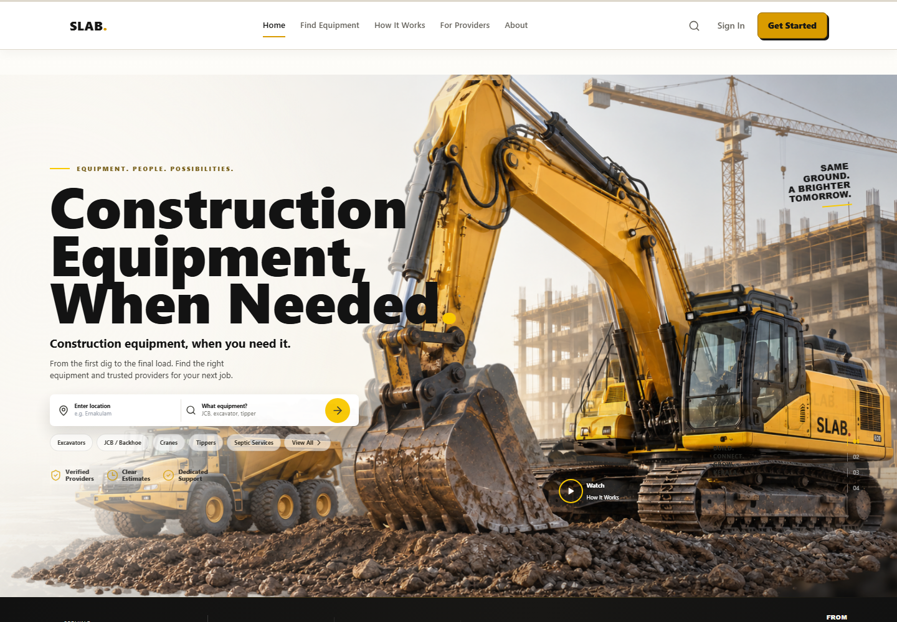

### Equipment Categories

Category discovery for excavators, JCB / backhoe, cranes, tippers, septic services, and related site work.

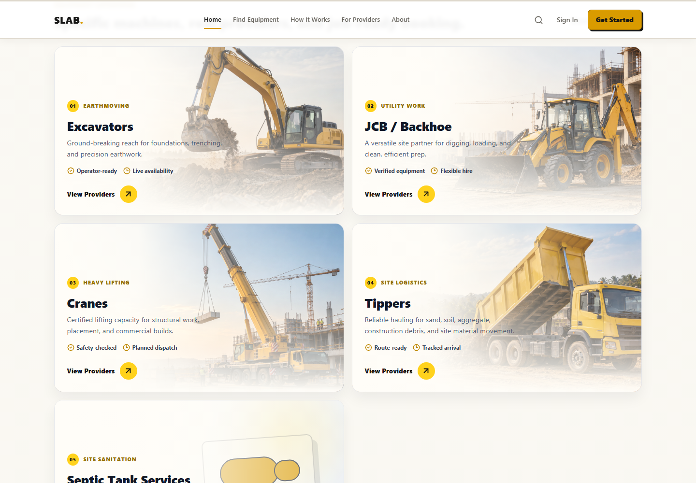

### Equipment Marketplace

Marketplace category view showing real provider and equipment listings from the application.

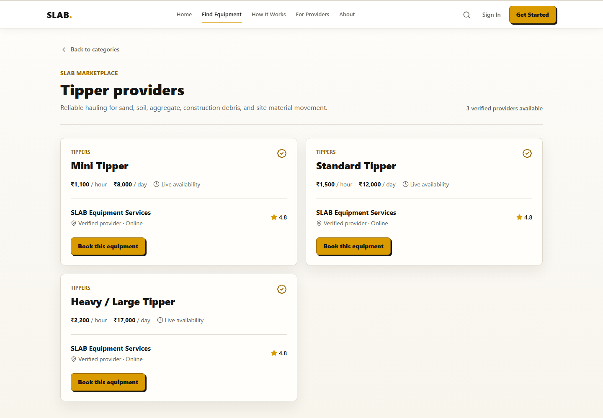

### How It Works

Customer-to-SLAB-to-provider workflow explaining the booking and matching journey.

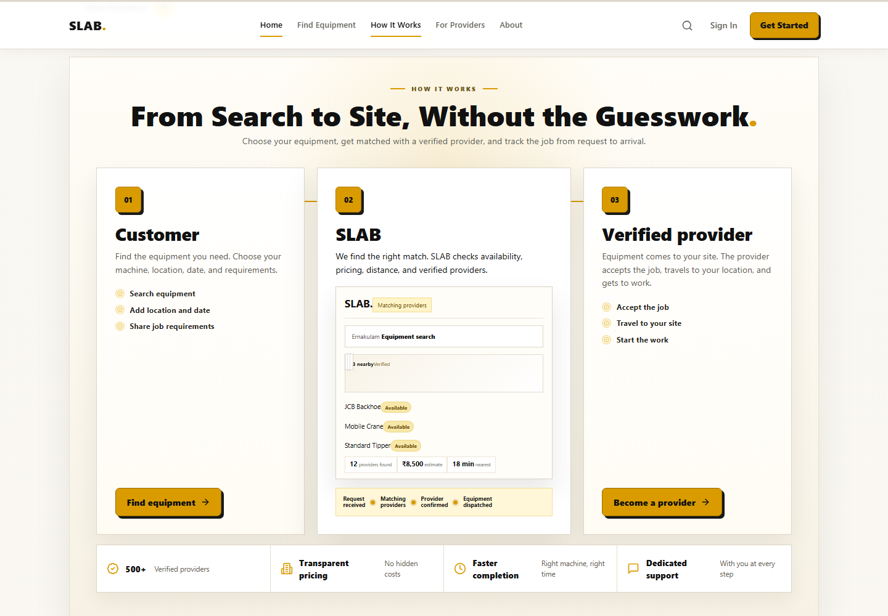

### Live Tracking

Live dispatch view with route, ETA, provider status, and the SLAB JCB tracking marker.

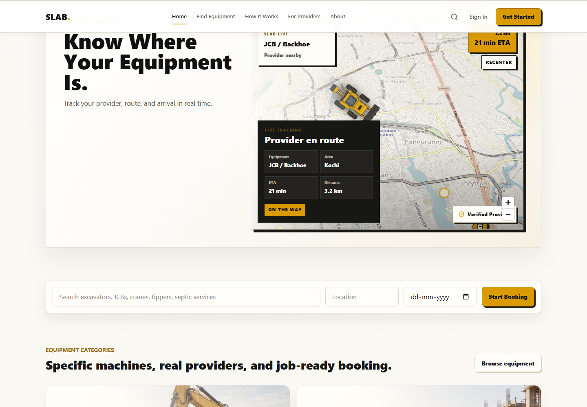

### Customer Booking

Equipment requirements, project selection, location, schedule, duration, and estimate workflow.

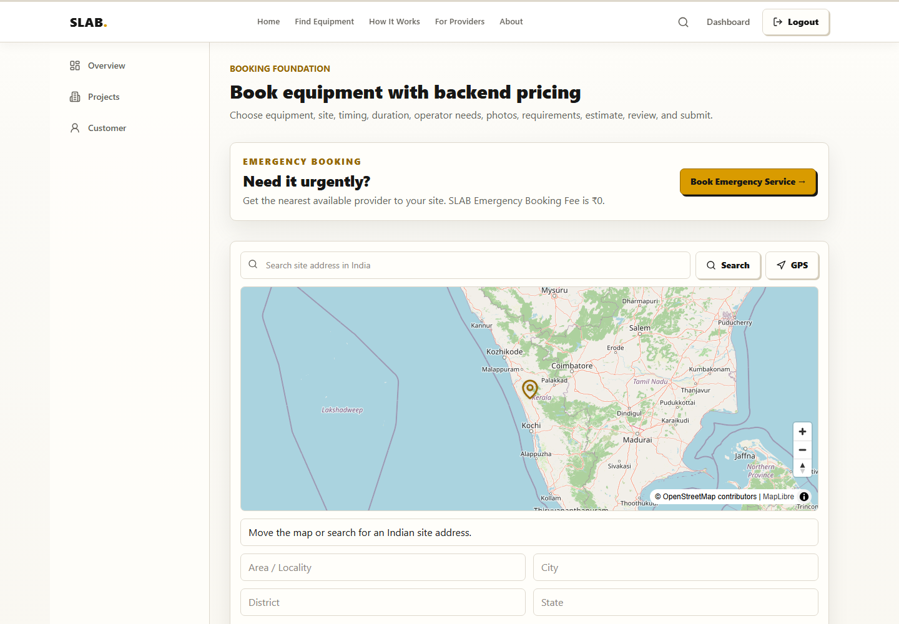

### Customer Workspace / Projects

Customer project workspace for organizing sites, bookings, work history, and project status.

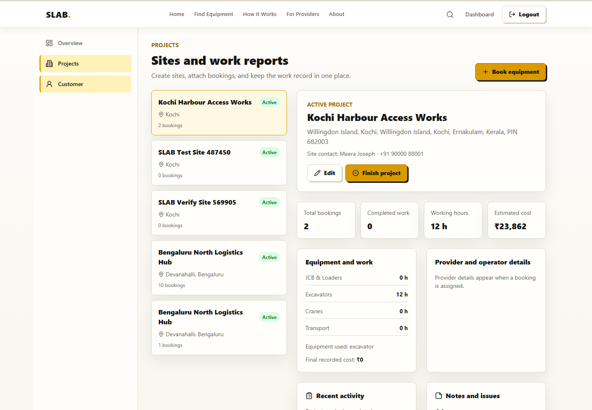

### Provider Dashboard

Provider operations dashboard with verification, equipment, incoming requests, active jobs, and dispatch controls.

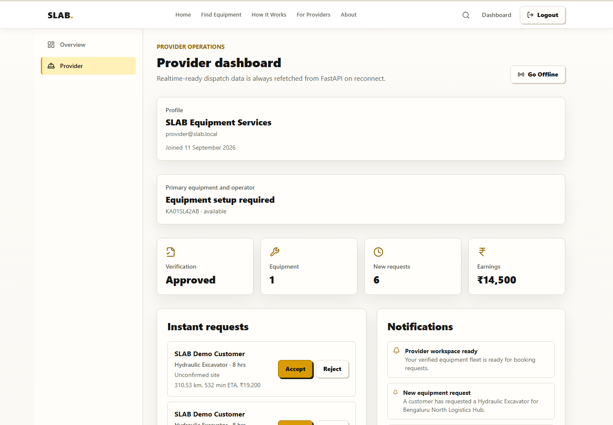

### Provider Job / Tracking

Provider job view for work details, route context, communication, and job progress actions.

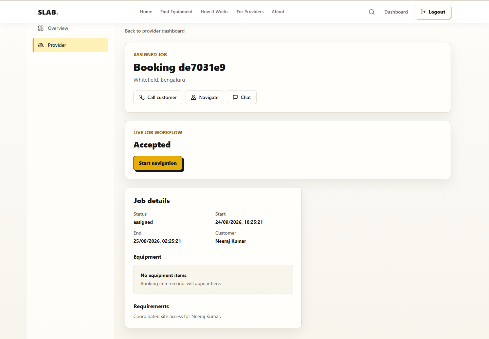

### Admin Dashboard

Protected admin area for SLAB operational management.

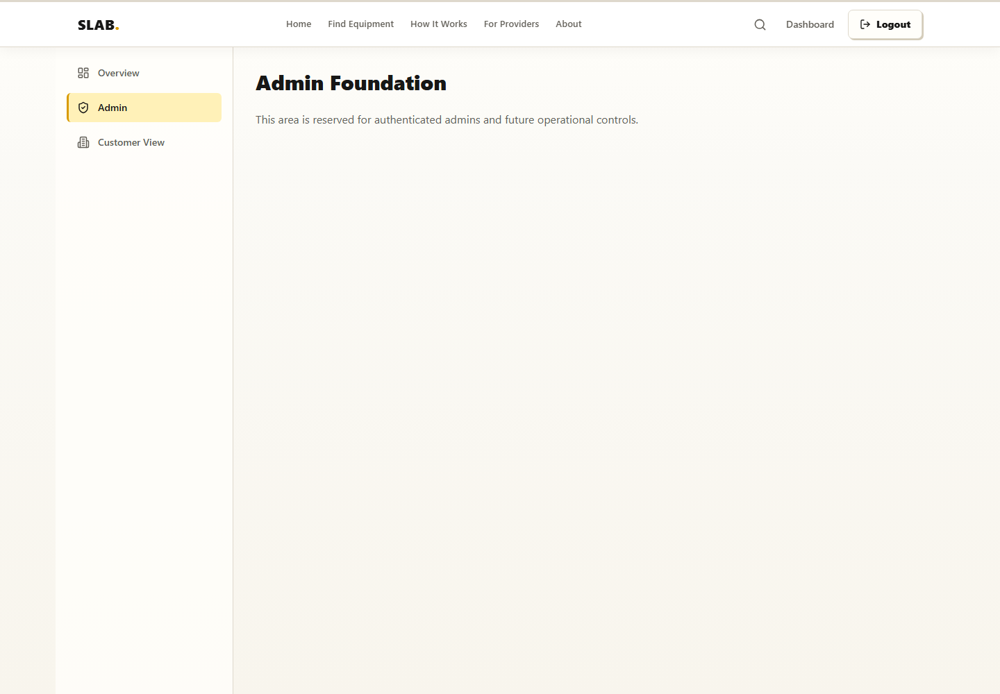

### Authentication

Role-aware sign-in experience for customer, provider, and admin access.

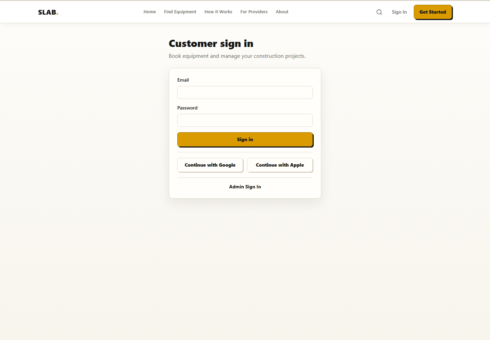
