# SLAB

**Construction equipment booking and site coordination platform for equipment providers and contractors.**

**[Live Application](https://slab-topaz.vercel.app/)** &nbsp;·&nbsp; Built for construction equipment workflows in regional Indian markets

---

## What Is SLAB?

SLAB is a full-stack marketplace that connects contractors and site managers with verified construction equipment providers. Customers can discover available equipment, get a transparent cost estimate, place a booking, and then track the provider's journey to the site — all from a single application.

The project covers the complete operational lifecycle of an equipment booking: from marketplace discovery through payment, provider dispatch, live GPS tracking, on-site PIN verification, and project-level cost reporting.

---

## The Real-World Problem

Booking construction equipment in regional Indian markets is still handled mostly through phone calls, personal networks, and word-of-mouth. This creates several compounding problems for contractors:

- **No visibility into availability.** Equipment owners don't publish schedules. A contractor must call three or four providers before finding one who is free on the required date.
- **No pricing transparency.** Rates vary by equipment type, duration, operator inclusion, and distance. There is no standard, and quotes are given verbally.
- **No reliable coordination.** Once a booking is confirmed informally, there is no tracking. Providers can arrive late or at the wrong site with no accountability mechanism.
- **No audit trail.** Contractors managing multiple sites cannot report equipment spend per project or per site without manual record-keeping.

For equipment providers, the problem is the reverse: a fragmented market with no efficient way to advertise availability, capture jobs, or manage a schedule across multiple customers.

---

## SLAB's Solution

SLAB structures the end-to-end workflow between contractors and providers into a digital system:

| Problem | What SLAB Does |
|---|---|
| Availability discovery | Live marketplace of verified providers and their equipment, filterable by category |
| Opaque pricing | Server-side pricing engine that breaks down every cost line before booking |
| No tracking | Real-time WebSocket GPS tracking with live ETA from OSRM routing |
| No verification | 4-digit job PIN issued at booking; provider must enter it on-site before work starts |
| No per-project accounting | Project workspace groups bookings by construction site and calculates total spend |

---

## Product Showcase

### Landing Page

*The homepage communicates the product value immediately and surfaces the equipment search bar. Navigation adapts for authenticated customers, providers, and admins.*

### Equipment Categories
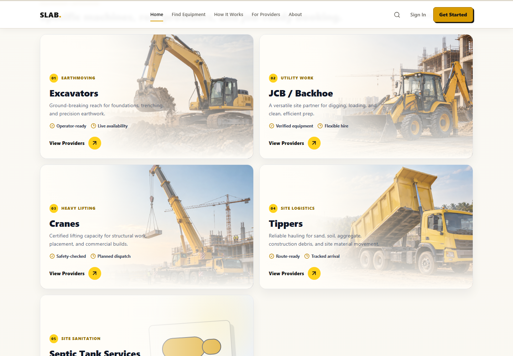
*Category cards surface excavators, JCBs, cranes, tippers, and septic services with badges for operator readiness, live availability, and safety verification.*

### Equipment Marketplace
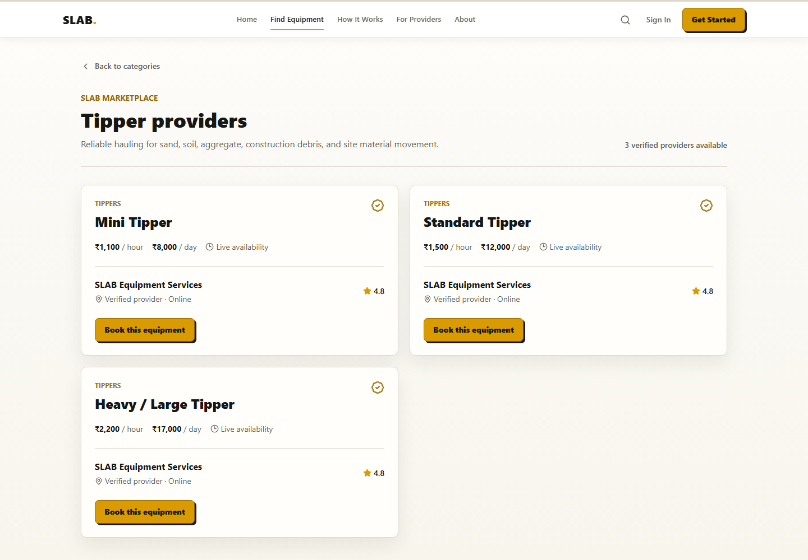
*Each equipment listing shows real-time hourly and daily rates, provider rating, online status, and verification badge. Customers can book directly from this view.*

### Customer Dashboard
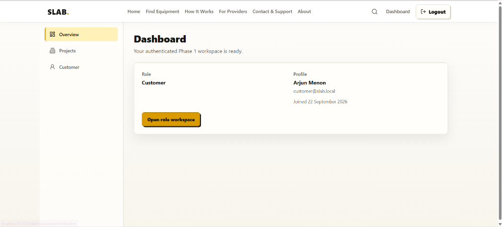
*The customer portal provides a centralized view for managing projects, tracking equipment bookings, and receiving dispatch updates.*

### Standard Booking
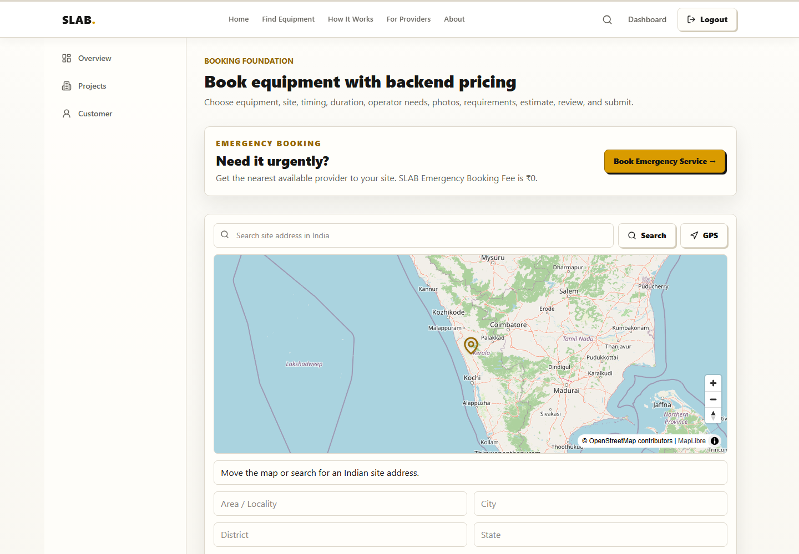
*The standard booking flow captures site location on a map, equipment type and duration, and produces a server-computed cost breakdown.*

### Emergency Booking
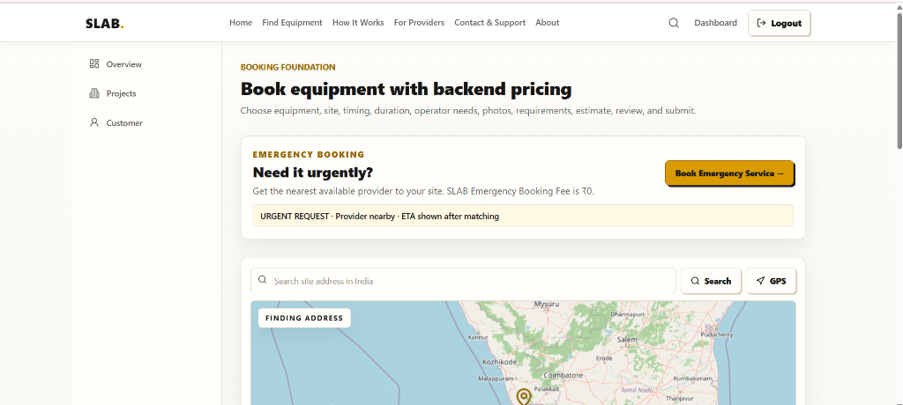
*Emergency bookings skip the standard queue, waive the platform fee, and trigger immediate radial expansion to find the nearest available provider.*

### Live Dispatch & Matching
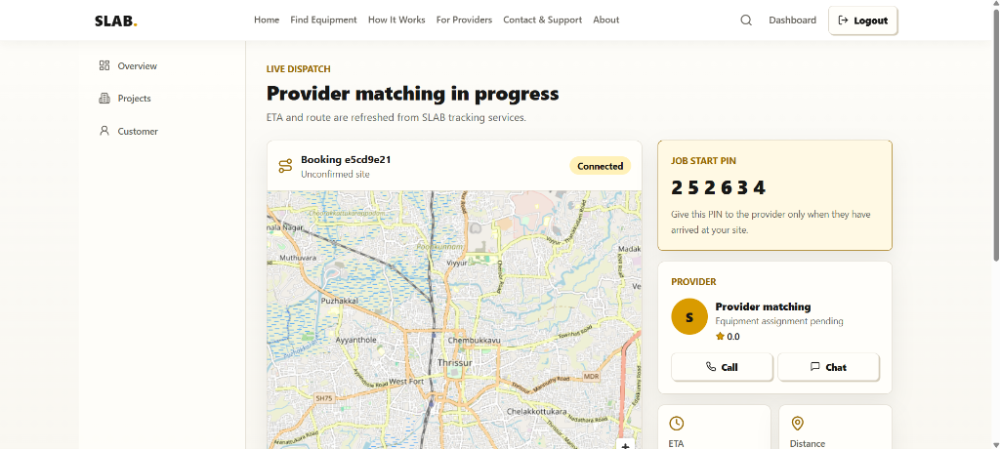
*While matching, the customer sees a live dispatch view containing the secure Job Start PIN. The system actively queries and assigns the best-fit provider.*

### Payment & Cost Estimate
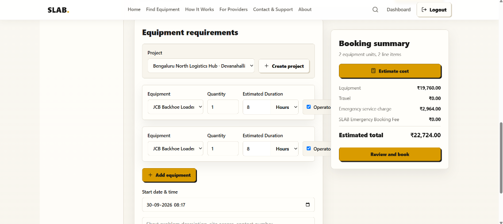
*Before payment, the customer reviews a fully itemised estimate including service charge, travel distance calculation, and the SLAB platform fee.*

### Live Tracking
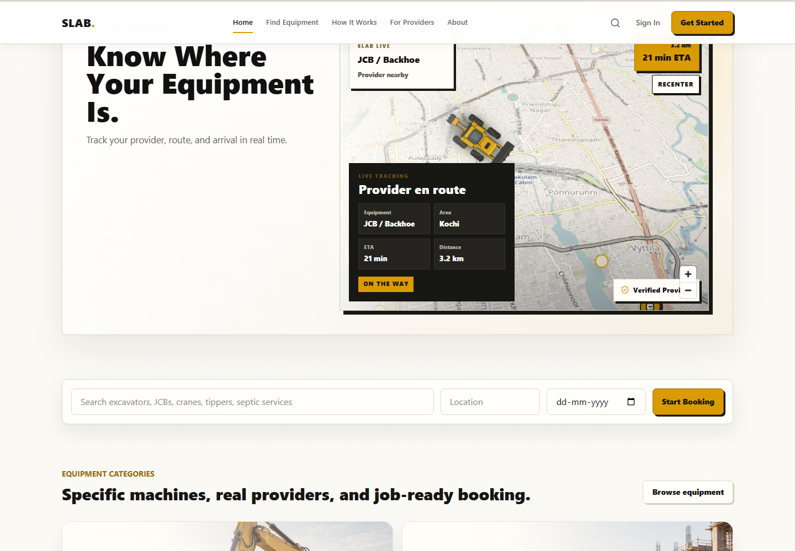
*Once a provider accepts a job, the customer sees their route on a MapLibre map with live ETA. The provider's device streams GPS updates over WebSocket.*

### Customer Projects
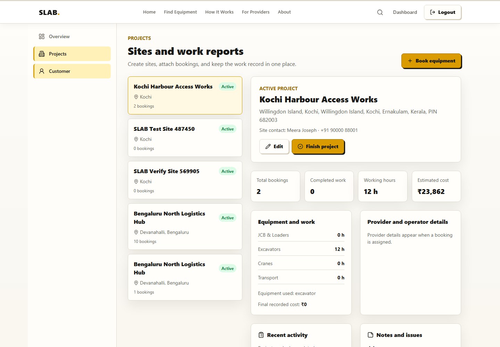
*The project workspace groups all bookings by construction site, showing total spend, working hours, equipment used, and provider assignments.*

### Provider Online / Offline Status
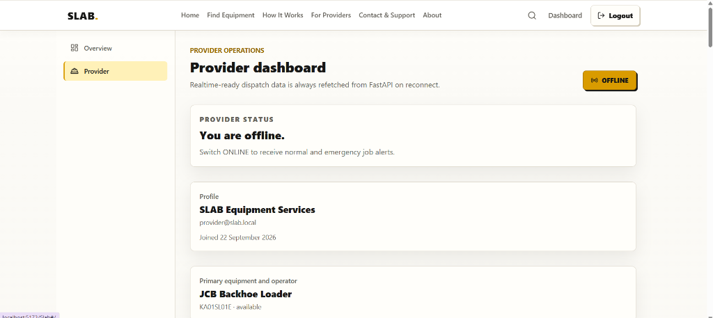
*Providers control their availability. When offline, they are removed from the active matching pool. Switching online instantly connects them to the dispatch WebSocket.*

### Provider Dashboard (Incoming Jobs)
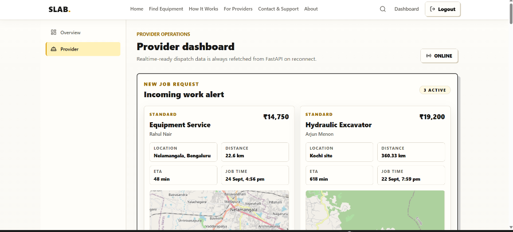
*Providers receive incoming job requests with site details, distance, and ETA calculated via OSRM, allowing them to accept or decline nearby work.*

### Provider Active Jobs

*For active jobs, providers can chat with the customer, navigate to the site, and update their operational state (en route, arrived, PIN verification, complete).*

### Provider Equipment & Availability
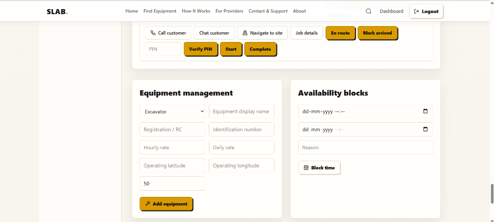
*Providers manage their equipment registry, update operating locations and rates, and block off unavailability time slots in their calendar.*

### Provider Live Tracking
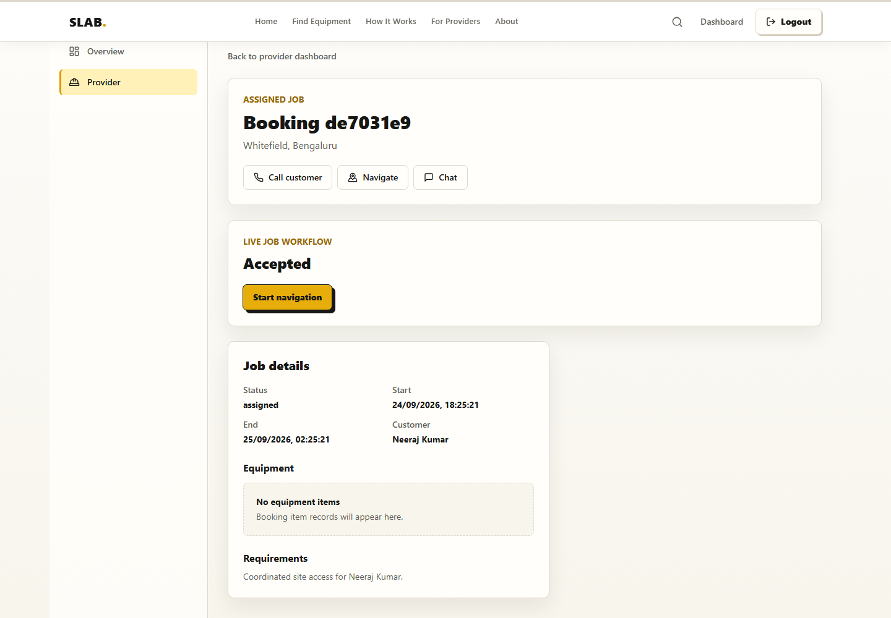
*Providers follow turn-by-turn directions to the customer site. Distance and ETA update live. The view transitions to an arrival confirmation state upon reaching the site.*

### Admin Dashboard
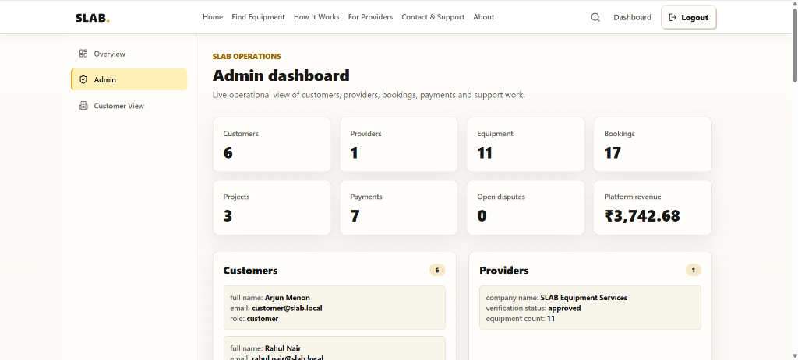
*Admins get a live operational view of the platform, tracking total customers, providers, equipment, active bookings, open disputes, and platform revenue.*

### Customer Support & Chatbot
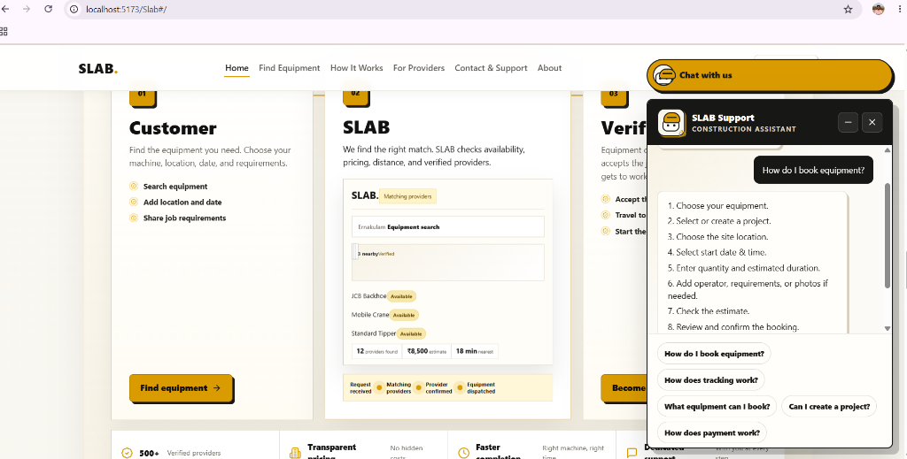
*The dedicated support desk provides contextual help and features an always-available interactive construction assistant chatbot for instant booking guidance.*

### Authentication
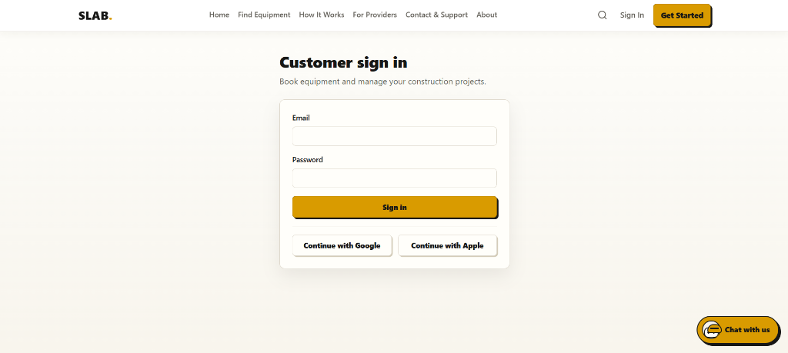
*Three-role authentication (Customer, Provider, Admin) with JWT tokens and role-based access control. Separate sign-in paths enforce the correct role context.*

------------

## User Roles

### Customer (Contractor / Site Manager)
Browses the marketplace, places bookings, tracks providers in real-time, manages site locations and projects, and reviews cost breakdowns per booking.

### Provider (Equipment Operator)
Registers equipment and service area, receives job alerts for nearby bookings, accepts or declines jobs, navigates to site, verifies arrival by PIN entry, and marks jobs complete.

### Admin
Configures equipment categories and base rates, manages provider verification, monitors active bookings, adjusts pricing multipliers, and has full visibility into platform activity.

---

## Equipment & Services Catalog

The catalog is defined server-side and priced in INR. Rates shown are base hourly / daily without operator or distance charges.

| Category | Equipment | Hourly | Daily |
|---|---|---|---|
| Excavators | Excavator | ?1,800 | ?14,000 |
| | Mini Excavator | ?1,300 | ?10,000 |
| JCB & Loaders | JCB Backhoe Loader | ?1,200 | ?9,000 |
| | Mini JCB | ?900 | ?7,000 |
| | Skid Steer Loader | ?1,100 | ?8,500 |
| | Wheel Loader | ?1,500 | ?12,000 |
| Cranes | Hydra / Pick & Carry | ?1,500 | ?12,000 |
| | Mobile Truck Crane | ?2,500 | ?20,000 |
| | Crawler Crane | ?4,000 | ?32,000 |
| | Tower Crane | ?5,000 | ?40,000 |
| Tippers | Mini Tipper | ?1,100 | ?8,000 |
| | Standard Tipper | ?1,500 | ?12,000 |
| | Heavy Tipper | ?2,200 | ?17,000 |
| Septic Services | Septic Tank Cleaning | ?2,200 | ?15,000 |
| | Septic Tank Emptying | ?2,400 | ?16,000 |
| | Emergency Septic Service | ?3,200 | ?22,000 |
| Waste Management | Waste Management | ?1,600 | ?11,000 |
| | Sewage / Waste Transportation | ?2,000 | ?14,000 |

---

## Standard Booking Flow

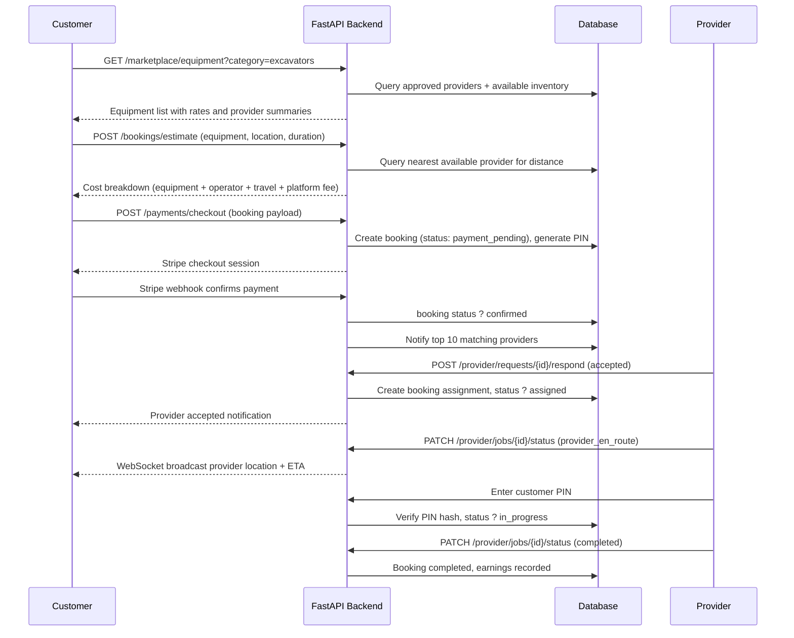
```mermaid
sequenceDiagram
    participant C as Customer
    participant API as FastAPI Backend
    participant DB as Database
    participant P as Provider

    C->>API: GET /marketplace/equipment?category=excavators
    API->>DB: Query approved providers + available inventory
    API-->>C: Equipment list with rates and provider summaries

    C->>API: POST /bookings/estimate (equipment, location, duration)
    API->>DB: Query nearest available provider for distance
    API-->>C: Cost breakdown (equipment + operator + travel + platform fee)

    C->>API: POST /payments/checkout (booking payload)
    API->>DB: Create booking (status: payment_pending), generate PIN
    API-->>C: Stripe checkout session

    C->>API: Stripe webhook confirms payment
    API->>DB: booking status ? confirmed
    API->>DB: Notify top 10 matching providers

    P->>API: POST /provider/requests/{id}/respond (accepted)
    API->>DB: Create booking assignment, status ? assigned
    API-->>C: Provider accepted notification

    P->>API: PATCH /provider/jobs/{id}/status (provider_en_route)
    API-->>C: WebSocket broadcast provider location + ETA

    P->>API: Enter customer PIN
    API->>DB: Verify PIN hash, status ? in_progress

    P->>API: PATCH /provider/jobs/{id}/status (completed)
    API->>DB: Booking completed, earnings recorded
```

---

## Emergency Booking

Emergency bookings skip the standard payment-pending state and go directly to provider dispatch. The pricing formula applies an emergency service surcharge — the greater of 15% of the equipment subtotal or ?750 — and waives the standard platform fee. The matching engine notifies providers with an "URGENT REQUEST" alert and expands the search radius progressively when nearby providers are unavailable.

---

## Pricing Engine

All pricing is computed server-side by `PricingService`. The client never calculates or manipulates cost figures.

```
Estimate = Sum( (HourlyRate + OperatorRate) x Hours x Quantity )
         + Distance x Rs3.25 per km
         + EmergencySurcharge (15% of equipment subtotal, min Rs750 — emergency only)
         + PlatformFee (8% of subtotal + travel — standard bookings only)
```

Key design choices:
- **Operator rate** is ?35/hour per item when an operator is requested.
- **Distance** is calculated using the Haversine formula against the nearest available provider's operating location, not a fixed origin.
- **Emergency and platform fees are mutually exclusive** — emergency bookings pay the surcharge instead of the platform fee.
- The pricing snapshot is stored on the booking at creation time, so historical estimates are never recalculated retroactively.

---

## Payment Architecture

SLAB uses a two-tier payment model:

1. **Platform fee** — Charged upfront via Stripe. This covers booking processing and provider matching. Stripe webhooks confirm payment before the booking proceeds.
2. **Service cost** — The equipment + operator + travel cost is settled directly between the contractor and provider. SLAB records the estimate but does not hold or process the full service amount.

This keeps the platform lightweight, avoids escrow complexity, and is consistent with how regional equipment hiring currently operates.

> **Note:** Stripe is integrated in test mode for the live demo. Use card `4242 4242 4242 4242` with any future expiry and any CVC.

---

## Location Intelligence

### Maps & Rendering
- **MapLibre GL** renders interactive maps in the browser with OpenStreetMap tile layers — no Google Maps dependency.
- Customers select their construction site by clicking a map pin or by text search; the site GPS coordinate is stored with the booking.

### Geocoding
- **Nominatim (OpenStreetMap)** handles forward search (address to coordinates) and reverse geocoding (coordinates to structured address).
- A coordinate fallback is implemented: if Nominatim is unavailable, the raw latitude/longitude string is stored and displayed instead of failing the request.

### Routing & ETA
- **OSRM** (Open Source Routing Machine) computes road distance and estimated travel time between the provider's current location and the customer site.
- If OSRM is unreachable, the backend falls back to a Haversine straight-line distance estimate, assuming average road speed of 35 km/h for ETA.

---

## Live Tracking

Live tracking uses a persistent WebSocket connection over `/ws/tracking/{booking_id}`.

- **Provider side:** The provider's browser streams `{type: "location", latitude, longitude}` messages while en route.
- **Backend:** `RealtimePersistenceService` validates the message, writes the location update to the database, and broadcasts to all subscribers of the tracking room.
- **Customer side:** Receives location updates and re-queries OSRM for updated distance and ETA. The map marker moves in real time.
- **Authentication:** WebSocket connections are authenticated using JWT passed as a query parameter (`?token=...`) or `Authorization` header.
- **Room isolation:** Each booking has its own tracking room keyed by `tracking:{booking_id}`, preventing cross-booking data leakage.

Additional WebSocket channels:
- `/ws/chat/{booking_id}` — Real-time booking-scoped chat between customer and provider.
- `/ws/notifications/{user_id}` — Push notifications for job requests, booking status changes, and system alerts.
- `/ws/provider-status/{provider_id}` — Broadcasts provider online/offline status to subscribed watchers.

---

## Job PIN Verification

When a booking is created, the backend generates a cryptographic PIN using `secrets.token_hex` and stores its hash (SHA-256). The plain PIN is returned to the customer only.

When the provider arrives on site:
1. The customer reads the PIN to the provider.
2. The provider enters it in their dashboard.
3. The backend hashes the submitted PIN and compares it to the stored hash.
4. On match, the booking status transitions to `in_progress`.

This gate prevents providers from marking work as started without confirmed on-site presence.

---

## Provider Workflow

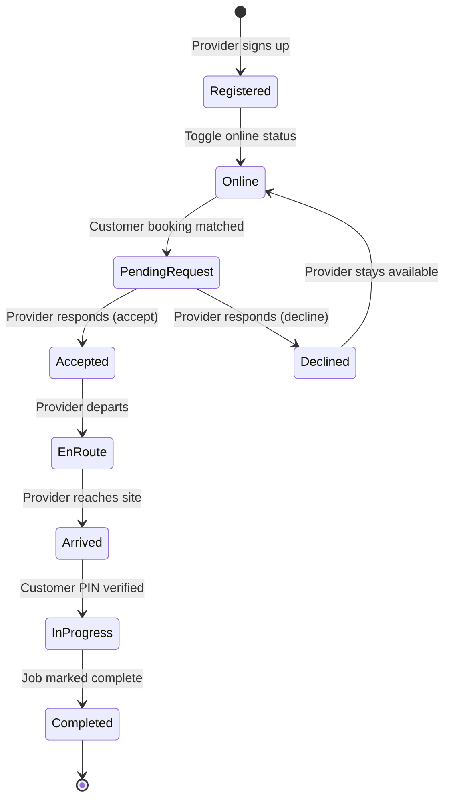
```mermaid
stateDiagram-v2
    [*] --> Registered: Provider signs up
    Registered --> Online: Toggle online status
    Online --> PendingRequest: Customer booking matched
    PendingRequest --> Accepted: Provider responds (accept)
    PendingRequest --> Declined: Provider responds (decline)
    Accepted --> EnRoute: Provider departs
    EnRoute --> Arrived: Provider reaches site
    Arrived --> InProgress: Customer PIN verified
    InProgress --> Completed: Job marked complete
    Completed --> [*]
    Declined --> Online: Provider stays available
```

Providers can also:
- Block time slots in their availability calendar to prevent conflicting job assignments.
- Register and manage their equipment (type, operating location, radius, hourly rate).
- Submit verification documents for admin review.
- View earnings history broken down by booking.

---

## Provider Alerts & Notifications

When a booking enters the `confirmed` state, the `MatchingService` identifies eligible providers and creates `provider_booking_requests`. For each request, it inserts a notification record:

- **Standard booking:** "New SLAB booking request — a nearby booking is waiting for your response."
- **Emergency booking:** "URGENT REQUEST — Emergency service needed nearby."

Notifications are delivered over the `/ws/notifications/{user_id}` WebSocket channel. The matching engine considers up to 10 ranked candidates per booking, sorted by distance (ascending) and estimated amount (descending). If no eligible provider is found, the customer receives a "No provider available" notification.

---

## Project Management

The customer project workspace groups bookings by construction site and produces a consolidated report:

- Total bookings, jobs completed, and jobs pending.
- Equipment used (list of equipment types across all bookings).
- Estimated and final cost totals.
- Hours logged per equipment category (Excavators, JCBs, Cranes, Transport).
- Providers assigned across all bookings for the project.
- Project-level notes and activity timeline.

A customer can manage multiple projects simultaneously, assign each booking to a project at creation time, and mark projects as active or completed.

---

## Customer Support & Chatbot

The Support page provides contextual help and an in-app chatbot for common questions about equipment, booking, and account issues. The chat interface is accessible from all pages via the floating chat widget visible in the product screenshots.

---

## Mobile Experience

The frontend is built with a responsive layout that adapts to mobile, tablet, and desktop viewports. The booking flow, marketplace, live tracking map, and provider dashboard are all functional on mobile screens. Native iOS and Android apps are not yet developed.

---

## Architecture

```
+-------------------------------------------------------------+
|                    React + TypeScript                        |
|   (Marketplace, Booking, Tracking, Provider, Admin)         |
|   MapLibre GL  Axios  React Router  TailwindCSS             |
+----------------------------+--------------------------------+
                             |  HTTPS REST + WebSocket
                             v
+-------------------------------------------------------------+
|                       FastAPI Backend                        |
|  +------------------+  +----------------------------------+  |
|  |  REST API /v1    |  |  WebSocket Channels              |  |
|  |  auth            |  |  /ws/tracking/{booking_id}       |  |
|  |  marketplace     |  |  /ws/chat/{booking_id}           |  |
|  |  bookings        |  |  /ws/notifications/{user_id}     |  |
|  |  payments        |  |  /ws/provider-status/{id}        |  |
|  |  maps / admin    |  +----------------------------------+  |
|  +------------------+                                        |
|  +-----------------------------------------------------------+|
|  |              Service Layer                               | |
|  |  PricingService  BookingService  MatchingService         | |
|  |  ProviderService  MapsService  RealtimeService           | |
|  +-----------------------------------------------------------+|
+------+---------------+--------------+------------------------+
       |               |              |
       v               v              v
  PostgreSQL        Stripe        OSRM / Nominatim
  (SQLAlchemy)    (webhooks)    (OpenStreetMap)
```

### Key Architectural Decisions

**1. Unified Document Store Over PostgreSQL**
Rather than using separate ORM models for each domain entity, SLAB uses a single `slab_records` table with a `table_name` column and a JSONB `data` column for flexible entity storage, alongside a normalized `users` table for authentication. The `LocalClient` class provides a query builder abstraction over SQLAlchemy that mirrors a Supabase-style API, keeping service code database-agnostic.

**2. Server-Side Pricing Only**
The pricing engine runs exclusively on the backend. The client sends equipment type, duration, location, and operator requirement; the server returns the full breakdown. This prevents client-side manipulation and ensures all customers see identical pricing for identical inputs.

**3. Haversine + OSRM Layered Routing**
Distances are first calculated using the Haversine formula for matching and pricing. When tracking begins, OSRM is queried for road-network distance and ETA. If OSRM is unreachable, the system falls back to Haversine with a 35 km/h average speed assumption.

**4. WebSocket Room Isolation**
Each real-time channel uses a keyed room string (`tracking:{booking_id}`, `notifications:{user_id}`, etc.). The `ConnectionManager` maps room keys to sets of connected WebSocket clients, so broadcasts are scoped correctly and never leak across bookings or users.

**5. Zero Commercial Map Dependency**
The entire geospatial stack — rendering, geocoding, and routing — is built on open-source tools (MapLibre GL, Nominatim, OSRM, OpenStreetMap). This eliminates per-request billing from commercial map APIs.

---

## Technology Stack

| Layer | Technology | Version |
|---|---|---|
| Frontend framework | React | 19 |
| Language | TypeScript | 5.7 |
| Build tool | Vite | 8 |
| Styling | Tailwind CSS | 3.4 |
| Map rendering | MapLibre GL | 6.9 |
| 3D / scene | React Three Fiber + Drei | 9.7 / 10.7 |
| HTTP client | Axios | 1.20 |
| Routing | React Router | 7 |
| Animation | GSAP | 3.14 |
| Backend framework | FastAPI | 0.115 |
| ASGI server | Uvicorn | 0.34 |
| ORM | SQLAlchemy | 2.0 |
| Data validation | Pydantic v2 | 2.10 |
| Settings | pydantic-settings | 2.7 |
| Database migrations | Alembic | 1.14 |
| Database | PostgreSQL 13+ / SQLite (local dev) | — |
| Authentication | PyJWT + passlib (bcrypt) | 2.10 / 1.7 |
| Payment processing | Stripe Python SDK | 11.5 |
| Geocoding / routing | Nominatim + OSRM | OpenStreetMap |
| HTTP async client | httpx | 0.28 |
| Testing (backend) | pytest + httpx | 8.3 |
| Testing (frontend) | Vitest + Testing Library | 5 / 16 |
| Frontend hosting | Vercel | — |
| Backend hosting | Render | — |

---

## Project Structure

```
slab/
+-- backend/
¦   +-- app/
¦   ¦   +-- api/
¦   ¦   ¦   +-- realtime.py           # WebSocket routes (tracking, chat, notifications)
¦   ¦   ¦   +-- v1/
¦   ¦   ¦       +-- router.py
¦   ¦   ¦       +-- endpoints/
¦   ¦   ¦           +-- auth.py
¦   ¦   ¦           +-- marketplace.py
¦   ¦   ¦           +-- customer_workspace.py
¦   ¦   ¦           +-- provider_workspace.py
¦   ¦   ¦           +-- payments.py
¦   ¦   ¦           +-- maps.py
¦   ¦   ¦           +-- admin.py
¦   ¦   ¦           +-- health.py
¦   ¦   +-- auth/
¦   ¦   ¦   +-- service.py            # JWT issuance, login, register
¦   ¦   ¦   +-- dependencies.py       # FastAPI auth dependencies
¦   ¦   ¦   +-- schemas.py
¦   ¦   +-- core/
¦   ¦   ¦   +-- config.py             # pydantic-settings (env vars)
¦   ¦   ¦   +-- exceptions.py         # AppException hierarchy + handlers
¦   ¦   ¦   +-- logging.py
¦   ¦   +-- database/
¦   ¦   ¦   +-- client.py             # Database client factory
¦   ¦   ¦   +-- local.py              # Auth user table (SQLAlchemy ORM)
¦   ¦   ¦   +-- local_client.py       # Document-store client over SQLAlchemy
¦   ¦   ¦   +-- models.py             # slab_records table
¦   ¦   ¦   +-- repositories/
¦   ¦   ¦       +-- base.py           # Generic CRUD repository
¦   ¦   +-- middleware/
¦   ¦   ¦   +-- request_context.py    # Request ID injection
¦   ¦   +-- schemas/                  # Pydantic request/response models
¦   ¦   +-- services/
¦   ¦   ¦   +-- matching_service.py   # Provider matching + Haversine distance
¦   ¦   ¦   +-- phase2_service.py     # Pricing, booking, project workspace
¦   ¦   ¦   +-- provider_service.py   # Provider workflow + PIN verification
¦   ¦   ¦   +-- maps_service.py       # Nominatim + OSRM integration
¦   ¦   ¦   +-- payment_service.py    # Stripe integration
¦   ¦   ¦   +-- realtime_service.py   # WebSocket connection manager
¦   ¦   +-- main.py                   # FastAPI app factory
¦   +-- alembic/                      # Database migrations
¦   +-- tests/
¦   +-- requirements.txt
¦   +-- .env.example
+-- frontend/
¦   +-- src/
¦   ¦   +-- api/
¦   ¦   ¦   +-- client.ts             # Axios instance + error normalisation
¦   ¦   +-- pages/                    # Route-level components
¦   ¦   +-- components/               # Shared UI components
¦   ¦   +-- features/                 # Feature-scoped modules
¦   ¦   +-- hooks/                    # Custom React hooks
¦   ¦   +-- services/                 # API call wrappers
¦   ¦   +-- types/                    # TypeScript interfaces
¦   ¦   +-- config/
¦   ¦   ¦   +-- env.ts                # Runtime environment config
¦   ¦   +-- support/                  # Support chatbot module
¦   +-- vite.config.ts
¦   +-- package.json
¦   +-- .env.example
+-- docs/
¦   +-- API.md
¦   +-- ARCHITECTURE.md
¦   +-- DATABASE.md
¦   +-- STRIPE.md
¦   +-- screenshots/
+-- docker-compose.yml
+-- README.md
```

---

## Authentication & Security

- **JWT tokens** are issued on login with an 8-hour expiry. The payload includes `sub` (user ID), `role`, and `exp`.
- **RBAC** is enforced at the endpoint level using FastAPI dependencies. Customer, Provider, and Admin routes are gated separately.
- **Passwords** are hashed with bcrypt via passlib. The plain password is never stored or logged.
- **WebSocket authentication** requires a valid JWT in the query parameter or Authorization header before any connection is accepted.
- **Production config validation** raises an error at startup if `DATABASE_URL` is not PostgreSQL, `JWT_SECRET` is unchanged from the default, `PAYMENT_MODE` is mock, or CORS origins include localhost.

---

## Database & Migrations

The production database is PostgreSQL. SQLite is used for local development to avoid requiring a local Postgres instance.

The schema uses two primary tables:
- `users` — Normalized records for authentication (id, email, password_hash, role, is_active).
- `slab_records` — Document store. Each row holds a `table_name` (e.g., `bookings`, `providers`, `notifications`) and a JSONB `data` column. Indexed on `table_name` and `record_id`.

Migrations are managed with **Alembic**.

```bash
# Apply all migrations
alembic upgrade head

# Create a new migration
alembic revision --autogenerate -m "describe_change"

# Roll back one step
alembic downgrade -1
```

---

## API Reference

The FastAPI backend provides automatic interactive docs when running locally:

- Swagger UI: `http://localhost:8000/docs`
- ReDoc: `http://localhost:8000/redoc`

| Prefix | Description |
|---|---|
| `/api/v1/auth` | Register, login, refresh, logout, /me |
| `/api/v1/marketplace` | Public equipment listing with provider summaries |
| `/api/v1/customer` | Booking estimates, create, cancel, projects, saved locations |
| `/api/v1/provider` | Dashboard, job requests, job status updates, PIN verification, equipment |
| `/api/v1/payments` | Stripe checkout initiation and webhook handling |
| `/api/v1/maps` | Address search, reverse geocoding, route calculation |
| `/api/v1/admin` | Pricing config, provider verification, booking management |
| `/api/v1/health` | Health check (Render readiness probe) |

All REST responses use the envelope format:
```json
{ "success": true, "data": { ... } }
{ "success": false, "error": { "code": "ERROR_CODE", "message": "..." } }
```

---

## Installation & Local Development

### Prerequisites

- Node.js 18+
- Python 3.9+
- Git
- PostgreSQL 13+ (optional — SQLite is used by default for local dev)

### Backend

```bash
cd backend

python -m venv .venv
.venv\Scripts\activate          # Windows
# source .venv/bin/activate     # macOS / Linux

pip install -r requirements.txt

cp .env.example .env
# Edit .env — at minimum set DATABASE_URL and JWT_SECRET

alembic upgrade head            # PostgreSQL only; SQLite auto-initialises

uvicorn app.main:app --reload --port 8000
```

API docs: `http://localhost:8000/docs`

### Frontend

```bash
cd frontend

npm install
cp .env.example .env

npm run dev
```

Frontend: `http://localhost:5173/Slab`

### Testing the Full Flow

1. Open `http://localhost:5173/Slab`
2. **Register** as a Customer ? browse ? create a booking ? pay (test card: `4242 4242 4242 4242`)
3. In a second browser, **register** as a Provider ? accept the job alert
4. Provider: update status to **En Route** — the customer map shows your position live
5. Provider: enter the **PIN** the customer reads from their dashboard
6. Provider: mark the job **complete**

---

## Environment Variables

### Backend (`backend/.env`)

```bash
ENVIRONMENT=production
LOG_LEVEL=INFO

DATABASE_URL=postgresql+psycopg://<username>:<password>@<host>:<port>/<dbname>

JWT_SECRET=<your_secure_jwt_secret_key>
JWT_ALGORITHM=HS256

STRIPE_SECRET_KEY=<your_stripe_secret_key>
STRIPE_PUBLISHABLE_KEY=<your_stripe_publishable_key>
STRIPE_WEBHOOK_SECRET=<your_stripe_webhook_secret>

FRONTEND_BASE_URL=https://<your_frontend_domain>
BACKEND_BASE_URL=https://<your_backend_domain>
CORS_ORIGINS=https://<your_frontend_domain>

NOMINATIM_BASE_URL=https://nominatim.openstreetmap.org
OSRM_BASE_URL=https://router.project-osrm.org
MAPS_USER_AGENT=<your_app_name> <your_contact_email>
```

### Frontend (`frontend/.env`)

```bash
# Optional — defaults to /api/v1 via Vite proxy
VITE_BACKEND_API_URL=http://localhost:8000/api/v1

VITE_STRIPE_PUBLISHABLE_KEY=pk_test_...
```

> **Never commit `.env` files.** Use `.env.example` as the checked-in template.

---

## Testing

```bash
# Backend
cd backend
pytest tests/ -v

# Frontend
cd frontend
npm test
npm run test:watch
```

Manual test cases:
- Customer: browse ? book ? pay ? track ? receive PIN
- Provider: receive alert ? accept ? navigate ? PIN entry ? complete
- Admin: adjust pricing ? verify provider ? view bookings
- Emergency booking: verify surcharge calculation and direct dispatch

---

## Implementation Status

| Feature | Status |
|---|---|
| Equipment marketplace (all categories) | ? Implemented |
| Booking flow with map-based site selection | ? Implemented |
| Server-side pricing engine (INR, line-item breakdown) | ? Implemented |
| Haversine + OSRM layered distance and routing | ? Implemented |
| Provider matching by equipment, distance, availability | ? Implemented |
| Stripe payment integration (platform fee) | ? Implemented |
| Real-time GPS tracking over WebSocket | ? Implemented |
| Job PIN verification (SHA-256 hashed) | ? Implemented |
| Customer project workspace and cost reporting | ? Implemented |
| JWT auth + three-role RBAC | ? Implemented |
| Provider dashboard (requests, jobs, earnings) | ? Implemented |
| Admin dashboard (pricing, verification, bookings) | ? Implemented |
| Booking-scoped real-time chat | ? Implemented |
| Push notifications over WebSocket | ? Implemented |
| Emergency booking (surcharge + direct dispatch) | ? Implemented |
| Responsive UI (desktop, tablet, mobile) | ? Implemented |
| Database migrations (Alembic + PostgreSQL) | ? Implemented |
| Provider performance analytics dashboard | ?? Planned |
| Email / SMS notifications | ?? Planned |
| Provider ratings connected to matching algorithm | ?? Planned |
| Dispute resolution workflow | ?? Planned |
| Native iOS / Android apps | ?? Future |
| Regional language support | ?? Future |
| Multi-region marketplace federation | ?? Future |
| Automated provider payouts | ?? Future |

---

## Production & Hosting

| Component | Platform |
|---|---|
| Frontend | Vercel |
| Backend | Render |
| Database | Managed PostgreSQL (Render) |

**Live Application:** https://slab-topaz.vercel.app/

---

## Documentation

| Document | Contents |
|---|---|
| [API.md](docs/API.md) | REST API overview |
| [ARCHITECTURE.md](docs/ARCHITECTURE.md) | Architecture decisions and component design |
| [DATABASE.md](docs/DATABASE.md) | Schema design and entity relationships |
| [STRIPE.md](docs/STRIPE.md) | Stripe integration and payment flow |
| [TRD.md](docs/TRD.md) | Technical Requirements Document |
| [SRS.md](docs/SRS.md) | Software Requirements Specification |

---

## Roadmap

**Near-term**
- Provider analytics: earnings trends, job acceptance rate, equipment utilisation
- Email and SMS notifications for booking confirmations and job alerts
- Dispute resolution workflow
- Advanced marketplace filters: location radius, available date, equipment subtype

**Medium-term**
- Provider ratings and reviews connected to the matching score
- Production load testing and connection pool tuning
- Admin pricing control panel UI

**Long-term**
- Native mobile apps
- Regional language support (Malayalam, Hindi, Tamil)
- Construction workforce and materials marketplace
- Automated provider payouts through Stripe Connect

---

## Current Status

SLAB is a working full-stack application with a live production deployment. The core booking loop — discovery, estimation, payment, provider dispatch, GPS tracking, PIN verification, and project reporting — is fully implemented and tested.

---

## Team

**Sreejith PV** — Backend architecture, API design, database schema, authentication, pricing engine, provider matching

**Randell Ronald** — Full-stack development, frontend UI/UX, real-time tracking, map integration, responsive design, deployment

---

## Contributing

Contributions are welcome. Please open an issue before submitting a pull request for significant changes.

**GitHub Issues:** [RandellRonald/Slab/issues](https://github.com/RandellRonald/Slab/issues)
**Email:** randellronald5@gmail.com

---

## License

MIT License. See [LICENSE](LICENSE) for details.


